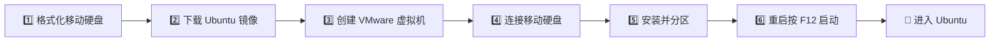

<div align="center">

<h1>💾 移动硬盘安装 Ubuntu 启动盘</h1>

**即插即用的随身 Ubuntu 系统**


</div>

---

## ✨ 简介

将 Ubuntu 系统**完整安装到外置移动硬盘**，插上硬盘就是 Ubuntu，拔下硬盘就回到 Windows，两者互不干扰：

- 🧳 **随身携带** —— 硬盘揣兜里，走到哪用到哪
- 🔄 **互不影响** —— 不修改电脑自带硬盘的任何数据
- 🚀 **随时切换** —— 开机按 F12 选择启动项即可

## 🧭 流程总览



## 📑 目录

| 安装步骤 | |
| --- | --- |
| [🛠 准备工作](#prepare) | [📦 硬盘分区](#partition) |
| [💾 格式化移动硬盘](#format) | [🔧 设置启动引导器](#bootloader) |
| [📀 下载 Ubuntu 镜像](#download) | [⏳ 等待安装完成](#finish) |
| [🖥 创建 VMware 虚拟机](#vm) | [🚀 从移动硬盘启动](#boot) |
| [🔌 连接移动硬盘](#connect) | [💡 使用提示](#tips) |
| [⚙️ 开始安装 Ubuntu](#install) | [❓ 常见问题](#faq) |

---

<a id="prepare"></a>
## 🛠 准备工作

| 项目 | 说明 |
| --- | --- |
| 💾 移动硬盘 | 建议 **SSD 固态移动硬盘**（机械硬盘最低要求）。U 盘写入速度不够，系统会卡顿 |
| 📀 Ubuntu 镜像 | 从 [中科大镜像源](https://mirrors.ustc.edu.cn/ubuntu-releases/22.04/) 下载桌面版 ISO 镜像文件 |
| 🖥 VMware 虚拟机 | 最新版 VMware Workstation |
| 💻 目标电脑 | Dell G15 5520（开机按 F12 进入启动菜单） |

---

## 🚀 安装步骤

<a id="format"></a>
### 1️⃣ 格式化移动硬盘

- 将移动硬盘格式化为干净的空闲分区（示例：1T 硬盘，前 900G 已有数据，后 31G 空闲用于安装）
- 已有数据的旧分区在安装时**不会被格式化**，可放心保留

<a id="download"></a>
### 2️⃣ 下载 Ubuntu 镜像

从 [中科大镜像源（Ubuntu 22.04）](https://mirrors.ustc.edu.cn/ubuntu-releases/22.04/) 下载桌面版 ISO 镜像文件。

> 💡 其他版本可访问 [ubuntu-releases](https://mirrors.ustc.edu.cn/ubuntu-releases/) 目录。

<a id="vm"></a>
### 3️⃣ 创建 VMware 虚拟机

1. 打开 VMware，选择"新建虚拟机"，镜像选择刚下载的 Ubuntu ISO
2. 磁盘大小随便填（如 50G），**不影响最终结果**——系统最终装到移动硬盘上，虚拟机只是"安装工具"
3. 勾选"创建后开启此虚拟机"
4. 自定义硬件：CPU、内存调高一些，可加快安装速度（**仅安装时有用**）
5. 启动虚拟机，选择第一项进入系统安装

<a id="connect"></a>
### 4️⃣ 连接移动硬盘到虚拟机

> ⚠️ **关键步骤**：必须把移动硬盘作为可移动设备加载进虚拟机，否则后面分区时看不到它。

在 VMware 菜单栏中，将移动硬盘（可移动设备 / USB 设备）连接到虚拟机。

<a id="install"></a>
### 5️⃣ 开始安装 Ubuntu

1. 语言选择**中文**，点击"安装 Ubuntu"
2. 选择**最小安装**
3. **取消勾选"安装 Ubuntu 时下载更新"**（否则安装时间会很久；装好系统后再换国内软件源更新会更快）
4. 安装类型选择**"其他选项"**（手动分区，装到移动硬盘上）

<a id="partition"></a>
### 6️⃣ 硬盘分区

此时会看到两个 `/dev/sda` 磁盘，**通过容量大小区分**：

| 磁盘 | 说明 |
| --- | --- |
| 上面的 `/dev/sda` | 虚拟机创建时分配的 50G 虚拟磁盘 |
| 下面的 `/dev/sda` | 你的移动硬盘 |

右键移动硬盘上的**空闲分区**，依次创建 3 个分区：

```
移动硬盘
├── ① EFI 系统分区 · 1000 MB ── 启动引导（必不可少）
├── ② swap 交换空间 · 8 GB ──── 建议与内存大小一致
└── ③ / 根目录 · 剩余全部 ───── Ext4 文件系统
```

| 顺序 | 类型 | 大小 | 说明 |
| --- | --- | --- | --- |
| 1️⃣ | EFI 系统分区 | 1000 MB | 系统启动引导，**没有它系统无法启动** |
| 2️⃣ | swap 交换空间 | 8 GB | 虚拟内存，建议与内存大小一致 |
| 3️⃣ | `/` 根目录（Ext4） | 剩余全部空间 | 包含所有系统文件 |

<a id="bootloader"></a>
### 7️⃣ 设置启动引导器

> ⚠️ **关键步骤**：安装类型界面底部的"**安装启动引导器的设备**"，必须选择刚才创建的 **EFI 分区**，不能选错。

<a id="finish"></a>
### 8️⃣ 等待安装完成

1. 确认提示后点击继续（移动硬盘上已有数据的分区不会被格式化）
2. 设置时区 → 设置用户名和密码
3. 开始安装，耐心等待：

| 硬盘类型 | 预计耗时 |
| --- | --- |
| SSD 固态硬盘 | 半小时以内 |
| 机械硬盘 | 40 分钟以上 |

4. 安装完成后提示重启——**此时 VMware 的使命已完成**，直接关闭虚拟机即可

<a id="boot"></a>
### 9️⃣ 从移动硬盘启动

1. 关闭电脑
2. 插上移动硬盘，开机
3. **疯狂按 F12** 进入启动菜单
4. 选择外接移动硬盘
5. 🎉 成功进入 Ubuntu 系统

---

<a id="tips"></a>
## 💡 使用提示

- 🪟 **想用 Windows？** 拔下移动硬盘正常开机即可，系统互不影响
- 🚀 **换软件源：** 安装完成后更换国内软件源（如[中科大源](https://mirrors.ustc.edu.cn/)、清华源、阿里云源），更新下载速度会快很多
- 🔌 **连接报错：** 移动硬盘连接虚拟机时报"连接到该虚拟机是不安全的"错误，请确认硬盘未被宿主机占用，或换一个 USB 接口重试

<a id="faq"></a>
## ❓ 常见问题

<details>
<summary><b>Q1：分区时如何区分虚拟磁盘和移动硬盘？</b></summary>

两个磁盘都显示为 `/dev/sda`，**通过容量大小区分**：容量接近虚拟机设置的（如 50G）是虚拟磁盘，另一个是你的移动硬盘。
</details>

<details>
<summary><b>Q2：移动硬盘连接虚拟机时报"不安全"错误怎么办？</b></summary>

确认移动硬盘没有被宿主机（Windows）或其他程序占用，尝试更换 USB 接口，或在 VMware 菜单"虚拟机 → 可移动设备"中重新连接。
</details>

<details>
<summary><b>Q3：拔下移动硬盘后还能正常进入 Windows 吗？</b></summary>

能。Windows 安装在电脑自带硬盘上，两个系统的引导器各自独立，拔下移动硬盘开机就是 Windows。
</details>

<details>
<summary><b>Q4：机械硬盘装 Ubuntu 会很卡吗？</b></summary>

安装耗时约 40 分钟以上（SSD 半小时以内）。日常使用机械硬盘可满足基本读写，但强烈建议使用 SSD 固态移动硬盘。
</details>

<a id="reference"></a>
## 🔗 参考

- [移动硬盘中安装 Ubuntu 20.10 系统史上最详细（终结篇）](https://blog.csdn.net/qq_33386775/article/details/111749677)
- [中科大 Ubuntu 镜像源](https://mirrors.ustc.edu.cn/ubuntu-releases/)

---

<div align="center">

Made with ❤️ · Ubuntu on the go 🚀

</div>
